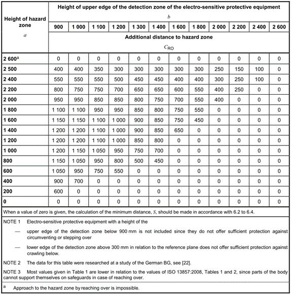

# 1.10.1. Installation of Safety Guards

<table class="tg">
<thead>
  <tr>
    <td class="tg-e3v1"> Warning</td>
    <td class="tg-cly1">Because there is a risk of collision between the robot and the worker when the robot operates, a safety fence should be installed to prevent workers from getting too close to the robot.</td>
  </tr>
</thead>
</table>

Because there is a risk of collision between the robot and the worker when the robot operates, a safety fence should be installed according to ISO 13855:2010 to prevent workers from getting too close to the robot. The robot should be configured such that it can stop if there is any act of opening the safety fence gate and accessing the facility during the operation of the robot for any reason, such as inspection of the robot or welding fixture, tip dressing, or tip changing.

Figure 1.12 Connection of the Safety Fence

Source: ISO 13855:2010 Safety of machinery — Positioning of safeguards with respect to the approach speeds of parts of the human body

Table 1-1 Installation Standard of the Safety Fence

Source: ISO 13855:2010 Safety of machinery - Positioning of safeguards with respect to the approach speeds of parts of the human body

*	Enough space for the safety fence should be secured to cover the work envelope and allow the workers to teach and repair without difficulty, and the safety fence should be sturdy enough to prevent it from being moved easily and structured so that people cannot easily step over it.

*	In principle, the safety fence should be installed in fixed manner. Please use a safety fence that does not have dangerous parts such as irregularities or sharp parts.

*	An entrance gate to allow entry inside the safety fence should be installed, and a safety plug must be installed on the entrance gate to prevent the gate from opening unless the plug is pulled out. Also, wiring should be carried out so that the robot will be in the Motor Off / Brake Hold state when the safety plug is pulled out or the safety fence is opened.

*	Wiring should be performed so that low-speed playback can occur when the robot needs to be operated while the safety plug is pulled out.
*	The emergency stop button should be installed at a place where it can be pushed quickly by the worker. 

*	If no safety fence is to be installed, safety devices such as photoelectric switches and mat switches, which can replace the safety plugs, should be installed for the entire area that falls within the specification of the safety guard of the robot such that the robot can be stopped automatically when a person enters the covered area.

*	It should be made possible to identify the work envelope (dangerous area) of the robot by a method such as painting the floor. 

