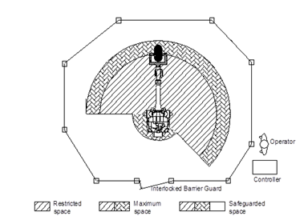

# 1.10.2. Placement of the Robot and Peripheral Devices

<table class="tg">
<thead>
  <tr>
    <td class="tg-e3v1"> Warning</td>
    <td class="tg-cly1">The robot should be installed and operated according to the guidelines of ISO 10218-2. In addition, the relevant requirements of the applicable international standards and national laws should be observed.  
When it comes to the accidents that may occur because of failure to comply with the relevant requirements of international standards and national laws, or failure to review our company (or the manufacturer) will not be responsible for them.</td>
  </tr>
</thead>
</table>

The installation should be performed by qualified installation personnel and conform with the relevant regulations and laws of the concerned country and region.

*	When unpacking the robot, check it for any possible damages that could occur during transporting or unpacking.

*	Before installing the product after unpacking it, the user must check the safety regulations and instructions and product installation and use environment information and fully understand the installation method.

*	When required to connect the primary power of the controller or peripheral device, check first if the supply side power is off before proceeding with the work. There is a risk of electric shock because of the use of high voltage as the primary power source. 

*	Attach the [Do Not Enter During Operation] sign to the entrance gate of the safety fence and inform the workers of its intent. 

*	Place the controller, interlock panel, and other operation panels in a way that they can be operated outside the safety fence. 

*	When installing an operation stand, attach an emergency stop button to it as well. It should be made possible to stop the robot in an emergency situation at any location from which the robot is operated. 

*	Make sure that the wires and pipes for the manipulator, controller, interlock panel, and timer are not caught on the feet of the workers or directly stepped on by the forklift. There is a risk of electric shock to workers, and disconnection of wiring can occur. 

*	Place the controller, interlock panel, operation stand, etc., in a location from which the movement of the manipulator can be seen sufficiently. There is a risk of major accident if the robot is malfunctioning or a worker is working in a location where you cannot see the operation of the robot.

*	Restrict the robot’s work envelope if the necessary work envelope is narrower than the area where the robot can operate. The work envelope can be limited by soft limits, limit switches, and stoppers. Even when the robot moves beyond the restricted area because of abnormal operation, such as by operating the robot incorrectly, the robot will be automatically stopped in advance by the work envelope limitation function. 

*	During welding, spatter may fall on the workers or surroundings, causing burns or fires. Install light shields, covers, etc., such that the movement of the manipulator can be seen sufficiently.

*	In the case of a device that shows the auto or manual mode of the robot, install the device conspicuously so that the operation status can be recognized even from a distance. An alarm from a buzzer or alarm light is useful when starting of the auto operation.

*	Make sure there is no protruding part on the peripheral devices around the robot. If necessary, cover them. In general, accidents may occur when a worker touches one of the devices, and major accidents may occur when a worker falls over after being surprised by the sudden movement of the robot.

*	Please do not design a system that requires putting your hand inside the safety fence to carry in or take out workpieces. There is a risk of being crushed or cut. 

Figure 1.13 Cylinder-Type Safety Fence for Industrial Robots

