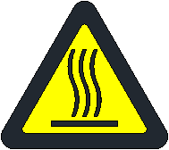

# 1.7.1. High Temperature Caution Label

Figure 1.1 High Temperature Caution Label

Please note that areas where this label is attached radiate heat. If you are required to work while the robot is in a heated state, makes sure to wear protective gear, such as heat-resistant gloves.