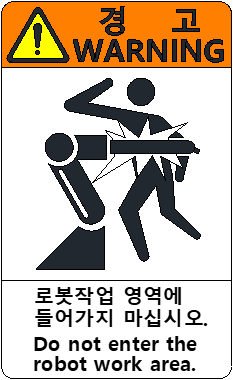

# 1.7.2. Collision Risk Label

Figure 1.2 Collision Risk Label

If a person is located within the robot’s work envelope, accidents may occur from collision, crushing, etc., because of the unexpected operation of the robot. During operation, make sure that no one is inside the work envelope and the operator is in a safe position. If a problem occurs, press the emergency stop button immediately.
