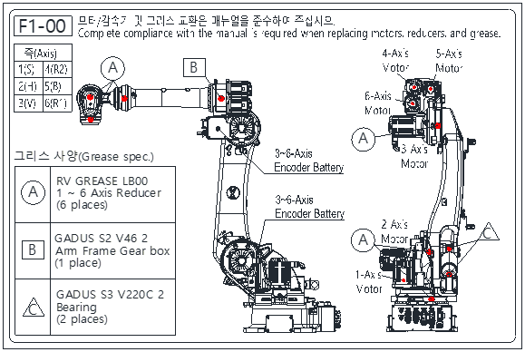

# 1.7.3. Grease Replenishment/Replacement Label

Figure 1.3 Grease Replenishment/Replacement Label

Follow the instructions on this label when replenishing or replacing grease.

For the specified grease, grease injection amount, and locations of the grease inlet and outlet, please refer to “5.1.1. Grease Injection After Grease Replacement and Reducer Replacement.”

