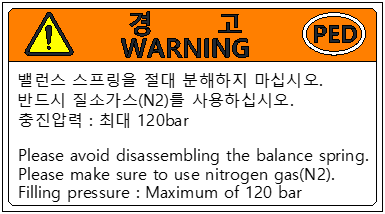

# 1.7.8. Gas Spring Disassembly Prohibition Label

Figure 1.8 Gas Spring Disassembly Prohibition Label

Do not disassemble the gas spring; it is very dangerous, as it is filled with high-pressure nitrogen. Make sure to use nitrogen gas when filling.

