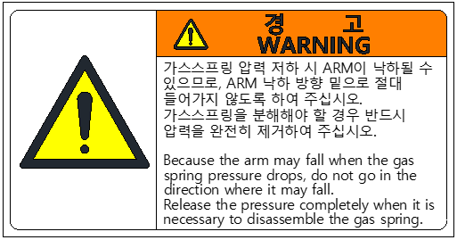

# 1.7.9. Caution Label Regarding the Replacement of the Gas Spring

Figure 1.9 Caution Label Regarding the Replacement of the Gas Spring

If the gas spring pressure drops, the robot arm may drop, so never approach below the arm’s dropping direction. 

