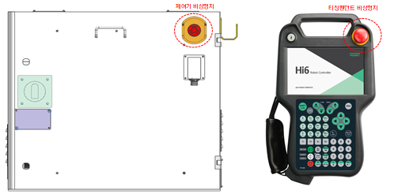
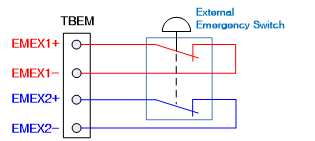

# 1.8.1. Main Safety Functions

* Emergency Stop ((IEC 60204-1,10,7)

There is one emergency stop button on the controller and teach pendant respectively. If necessary, additional emergency buttons can be connected to the robot’s safety chain circuit. The emergency stop function is applied with priority over all other control functions of the robot. It will bring the robot to a halt by immediately cutting off the power supply to the motors of individual axes of the robot and also disabling the use of safety-related functions controlled by the robot. 

<table class="tg">
<thead>
  <tr>
    <td class="tg-b001"> Caution</td>
    <td class="tg-cly1">The emergency stop immediately cuts off the motor power, so indiscriminate use of this function may cause accumulation of fatigue in terms of the robot’s durability. You must use it only in emergency situations.</td>
  </tr>
</thead>
</table>

Figure 1.10 Emergency Stop Switches on the Controller and Teach Pendant

Figure 1.11 Connection of an Additional Emergency Stop Device

*	Protective Stop (ISO 10218-1:2011)

The robot should have multiple safety inputs that can be used in connection with external safety devices, such as safety guards, safety pads, safety lights, etc. Coming from the robot itself, surrounding facilities, etc., these safety inputs will make the robot stop, ensuring a safe state. For details on safety input connections, see “4.3.2. Safety Modules (BD632) in the Hi6-N Controller Maintenance Manual.”

*	Speed Limitation (EN ISO 10218-1:2011)

In manual operation mode, the maximum speed of the robot is limited to 250 mm/s. The speed limit applies not only to the tool center point (TCP) but to all parts of the robot that can be manually operated. Additionally, it should be able to monitor the speed of the equipment mounted on the robot.

*	Work Envelope Restriction (ANSI/RIA R15.06-2012)

When operating the robot, the user can limit its work envelope using limit switches and stoppers to secure a sufficient safe area. This function can minimize possible damages if the robot collides with an external safety device, such as a safety guard. The work envelope of axes 1, 2, and 3 is limited by stoppers or limit switches. If the work envelope is changed by a stopper or limit switch, its limit parameters should be changed in the software as well. For the changes, please refer to “7.4.3. Soft Limit in the Hi6 Controller Manual.” The limit of the work envelope of each axis can be changed by the user and is set to the maximum work envelope of the robot at the time of shipment. The Hi6 controller’s safety system can support up to four limit switches as an option. For matters related to connection, refer to “4.3.2. Safety Module (BD632) in the Hi6-N Controller Maintenance Manual.

*	Selection of Operation Mode (ANSI/RIA R15.06-2012)

The robot can be operated manually, automatically, or in remote mode. In manual mode, the maximum speed is limited to 250 mm/s, and operation can be performed only through the teach pendant. A mode switch can be additionally installed on the control panel by configuring the options. For details on operation, please refer to “2. Operation in the Hi6 Controller Operation Manual.”

