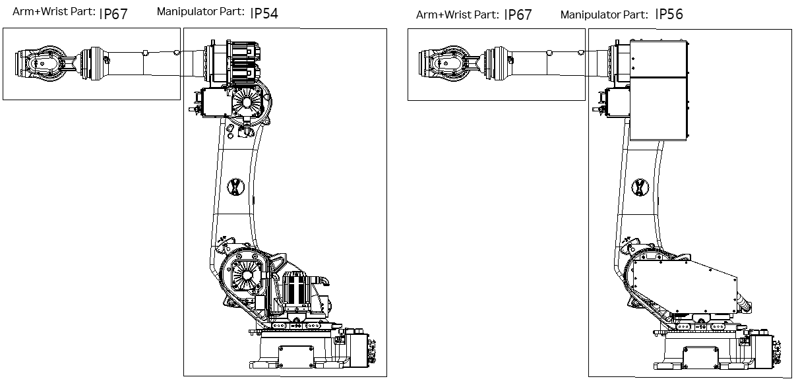

# 2.10. Dustproof and Waterproof Specifications, and Motor Covers (Optional)

In the case of US220, its IP rating is classified as follows depending on the cover option. A cover can be added to suit the IP rating according to the user’s request

Figure 2.24 Dustproof and Waterproof Specifications

Table 2-9 Definitions of IP Ratings

<table class="tg">
<thead>
  <tr>
    <th class="tg-yhpm" rowspan="4">Dustproof</th>
    <th class="tg-yhpm">IP3●</th>
    <th class="tg-nrix">Solid objects such as tools and wires exceeding 2.5 mm in diameter or thickness do not intrude.</th>
  </tr>
  <tr>
    <th class="tg-yhpm">IP4●</th>
    <th class="tg-nrix">Solid objects such as tools and wires exceeding 1.0 mm in diameter or thickness do not intrude.</th>
  </tr>
  <tr>
    <th class="tg-yhpm">IP5●</th>
    <th class="tg-nrix">Dust does not intrude the inside beyond the level that affects operation.</th>
  </tr>
  <tr>
    <th class="tg-yhpm">IP6●</th>
    <th class="tg-nrix">Dust does not intrude the inside.</th>
  </tr>
</thead>
<tbody>
  <tr>
    <td class="tg-yhpm" rowspan="4">Waterproof</td>
    <td class="tg-yhpm">IP●4</td>
    <td class="tg-nrix">Even when water droplets fly from any direction, it has no harmful effects.</td>
  </tr>
  <tr>
    <td class="tg-yhpm">IP●6</td>
    <td class="tg-nrix">Even when water droplets fly from any direction, it has no harmful effects.
Even when water is sprayed directly from any direction, it has no harmful effects.
</td>
  </tr>
  <tr>
    <td class="tg-yhpm">IP●6</td>
    <td class="tg-nrix">Even when water is sprayed directly from any direction, no water will intrude the inside.</td>
  </tr>
  <tr>
    <td class="tg-yhpm">IP●7</td>
    <td class="tg-nrix">Even when a part is submerged in water under certain conditions, no water intrudes the inside.</td>
  </tr>
</tbody>
</table>