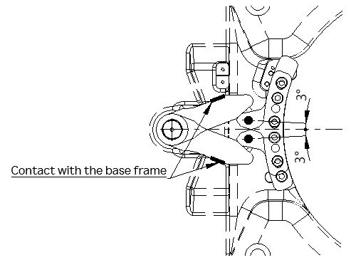

# 2.9.1. 1-Axis Stopper 

While the stoppers of the axes 2 and 3 are fixed, in the case of the stopper of axis 1, the location of the stopper block attached to the lower frame can be adjusted to allow the work envelope to be adjusted. 

Figure 2.10 Locations of the Stoppers, Limit Switches, and Stopper Blocks

<table class="tg">
<thead>
  <tr>
    <td class="tg-b001"> Caution</td>
    <td class="tg-cly1">The 1-axis stopper is a physical device and attached at a location where the operation angle is ±180˚. A deviation of ±3˚ from the angle causes contact with the base frame. After contact, the stopper and stopper block may be deformed, and their strength cannot be guaranteed once they are deformed, so make sure to replace them.</td>
  </tr>
</thead>
</table>

Figure 2.11 Stopper Contract Range

Please install the stopper block according to Figure 2.12 and the bolt specification shown below.

-	Bolt: M12X45L HEX SOCKET BOLT, 3EA
-	Washer: M12 PLANE WASHER, 3EA
-	Tightening torque: 1180 kgf.cm (116 N.m)

Figure 2.12 Installation of the 1-Axis Stopper Block and Dog Pins (when the limit option applies)

Depending on the installation conditions of the stopper block, the operation angle can be set at intervals of 5˚. For the details of the setting method, refer to examples in Table 2 3 and Figure 2.13.
 
Table 2-3 Installation Conditions for the 1-Axis Stopper Block

<table class="tg">
<thead>
  <tr>
    <th class="tg-3h1q">CASE</th>
    <th class="tg-3h1q">1(basic)</th>
    <th class="tg-3h1q">2</th>
    <th class="tg-3h1q">3</th>
  </tr>
</thead>
<tbody>
  <tr>
    <td class="tg-3h1q">Installation surface</td>
    <td class="tg-3h1q" colspan="2">Surface A</td>
    <td class="tg-3h1q">Surface B</td>
  </tr>
  <tr>
    <td class="tg-3h1q">Bolt Hole</td>
    <td class="tg-3h1q">Set (1)</td>
    <td class="tg-3h1q">Set (2)</td>
    <td class="tg-3h1q">Set (1)</td>
  </tr>
  <tr>
    <td class="tg-9wq8"></td>
    <td class="tg-9wq8"></td>
    <td class="tg-9wq8"></td>
    <td class="tg-9wq8"></td>
  </tr>
  <tr>
    <td class="tg-9wq8">Maximum work envelope (direction of +)</td>
    <td class="tg-9wq8">180˚</td>
    <td class="tg-9wq8">175˚</td>
    <td class="tg-9wq8">185˚</td>
  </tr>
  <tr>
    <td class="tg-9wq8">Maximum work envelope (direction of -)</td>
    <td class="tg-9wq8">-180˚</td>
    <td class="tg-9wq8">-185˚</td>
    <td class="tg-9wq8">-175˚</td>
  </tr>
  <tr>
    <td class="tg-9wq8">Intervals of the regulated angles</td>
    <td class="tg-9wq8" colspan="3">15˚</td>
  </tr>
</tbody>
</table>

    
 

Table 2-4 Work Envelope for Each Installation Condition for the 1-Axis Stopper Block

<table class="tg">
<thead>
  <tr>
    <th class="tg-gm1x" colspan="10">CASE 1(basic)</th>
  </tr>
</thead>
<tbody>
  <tr>
    <td class="tg-gm1x">Work envelope (+)</td>
    <td class="tg-nrix">180˚</td>
    <td class="tg-nrix">165˚</td>
    <td class="tg-nrix">150˚</td>
    <td class="tg-nrix">135˚</td>
    <td class="tg-nrix">120˚</td>
    <td class="tg-nrix">…</td>
    <td class="tg-nrix">45˚</td>
    <td class="tg-nrix">30˚</td>
    <td class="tg-nrix">15˚</td>
  </tr>
  <tr>
    <td class="tg-gm1x">Work envelope (-)</td>
    <td class="tg-nrix">-180˚</td>
    <td class="tg-nrix">-195˚</td>
    <td class="tg-nrix">-210˚</td>
    <td class="tg-nrix">-225˚</td>
    <td class="tg-nrix">-240˚</td>
    <td class="tg-nrix">…</td>
    <td class="tg-nrix">-315˚</td>
    <td class="tg-nrix">-330˚</td>
    <td class="tg-nrix">-345˚</td>
  </tr>
  <tr>
    <td class="tg-gm1x" colspan="10">CASE 2</td>
  </tr>
  <tr>
    <td class="tg-gm1x">Work envelope (+)</td>
    <td class="tg-nrix">175˚</td>
    <td class="tg-nrix">160˚</td>
    <td class="tg-nrix">145˚</td>
    <td class="tg-nrix">130˚</td>
    <td class="tg-nrix">115˚</td>
    <td class="tg-nrix">…</td>
    <td class="tg-nrix">40˚</td>
    <td class="tg-nrix">25˚</td>
    <td class="tg-nrix">10˚</td>
  </tr>
  <tr>
    <td class="tg-gm1x">Work envelope (-)</td>
    <td class="tg-nrix">-185˚</td>
    <td class="tg-nrix">-200˚</td>
    <td class="tg-nrix">-215˚</td>
    <td class="tg-nrix">-230˚</td>
    <td class="tg-nrix">-245˚</td>
    <td class="tg-nrix">…</td>
    <td class="tg-nrix">-320˚</td>
    <td class="tg-nrix">-335˚</td>
    <td class="tg-nrix">-350˚</td>
  </tr>
  <tr>
    <td class="tg-gm1x" colspan="10">CASE 3</td>
  </tr>
  <tr>
    <td class="tg-gm1x">Work envelope (+)</td>
    <td class="tg-nrix">170˚</td>
    <td class="tg-nrix">155˚</td>
    <td class="tg-nrix">140˚</td>
    <td class="tg-nrix">125˚</td>
    <td class="tg-nrix">110˚</td>
    <td class="tg-nrix">…</td>
    <td class="tg-nrix">45˚</td>
    <td class="tg-nrix">30˚</td>
    <td class="tg-nrix">5˚</td>
  </tr>
  <tr>
    <td class="tg-gm1x">Work envelope (-)</td>
    <td class="tg-nrix">-190˚</td>
    <td class="tg-nrix">-205˚</td>
    <td class="tg-nrix">-215˚</td>
    <td class="tg-nrix">-235˚</td>
    <td class="tg-nrix">-250˚</td>
    <td class="tg-nrix">…</td>
    <td class="tg-nrix">-325˚</td>
    <td class="tg-nrix">-340˚</td>
    <td class="tg-nrix">-355˚</td>
  </tr>
</tbody>
</table>

 

Figure 2.13 Examples of Each Case of the Work Envelope / Regulated Angle of the 1-Axis Stopper Block