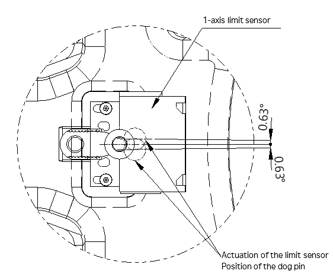

# 2.9.2.1. Application of the 1-Axis Limit Switch (Optional)

The 1-axis limit switch is optional, and when applying a limit switch, attach the dog pin to the stopper block by fastening the bolt according to the criteria shown below, by referring to Figure 2.14.

-	Bolt: M5X25L HEX SOCKET BOLT, 1EA
-	Tightening torque: 83 kgf.cm (8.14 N.m)

The 1-axis work envelope can be set by adjusting the position of the stopper block. Please refer to the examples in Table 2 3and Figure 2.13.

Depending on the starting position where the limit switch is pressed by the dog, there may be an error of approximately 0.63˚ in the work envelope.

Figure 2.14 1-Axis Limit Switch Contact Error Range
