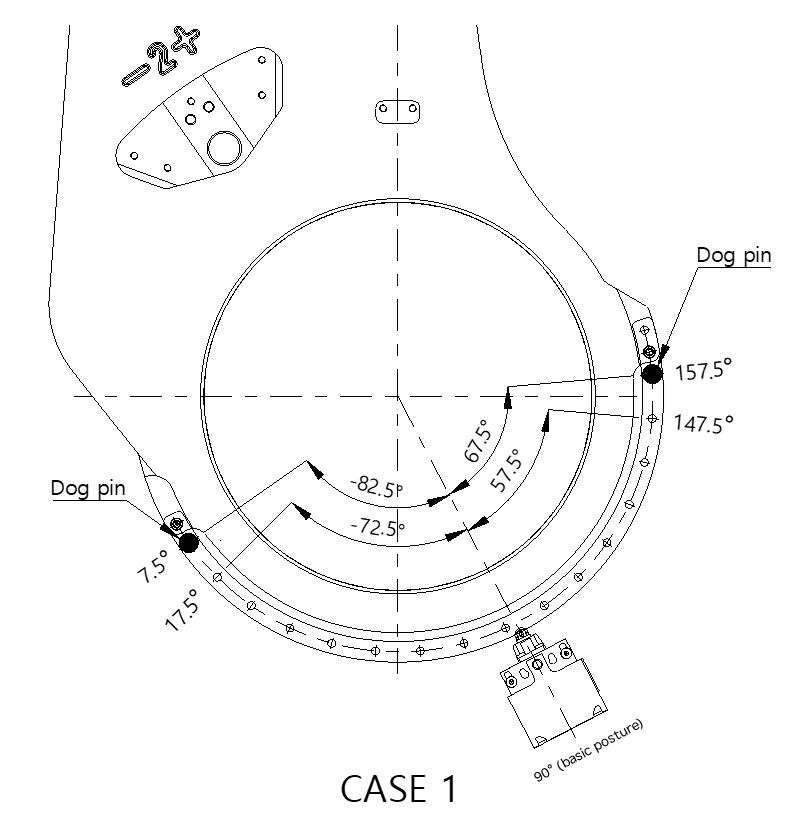
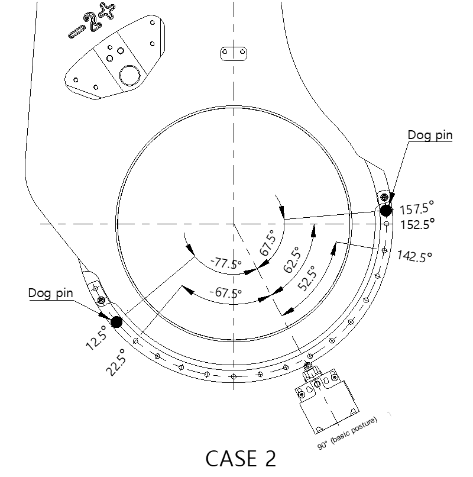
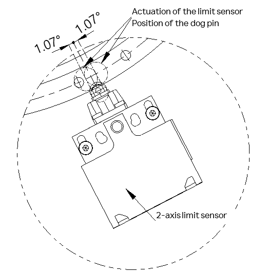

# 2.9.2.2. Application of the 2-Axis Limit Switch (Optional)

The 2-axis limit switch is optional, and when applying a limit switch, attach the dog pin to the limit switch plate by fastening the bolt according to the criteria shown below, by referring to Figure 2.15.

-	Limit switch plate fixing bolt: M5X10L HEX SOCKET BOLT, 2EA
-	Dog pin fixing bolt: M5X10L HEX SOCKET BOLT, 2EA
-	Tightening torque: 83 kgf.cm (8.14 N.m)

Figure 2.15 Installation of the 2-Axis Limit Switch Plate and Dog Pins

The 2-axis work envelope can be basically set by adjusting the position of the two dog pins. Dog pins can be installed at the intervals of 10˚, and when the position of the fixing hole of the plate is changed, the work envelope can be limited at the intervals of 5˚. For the work envelope for each case, refer to Table 2 5, Table 2 6and Figure2.16 – Figure 2.18.

Figure 2.16 2-Axis Limit Switch Plate Fixing Position

Table 2-5 Cases of the 2-Axis Limit Switch Plate Installation

<table class="tg">
<thead>
  <tr>
    <th class="tg-3h1q">CASE</th>
    <th class="tg-3h1q">1(basic)</th>
    <th class="tg-3h1q">2</th>
  </tr>
</thead>
<tbody>
  <tr>
    <td class="tg-3h1q">POSITION SET</td>
    <td class="tg-3h1q">SET(1)</td>
    <td class="tg-3h1q">SET(2)</td>
  </tr>
 <tr>
    <td class="tg-3h1q">Max. work envelope</td>
    <td class="tg-9wq8">7.5˚~157.5˚</td>
    <td class="tg-9wq8">12.5˚~157.5˚</td>
  </tr>
</tbody>
</table>

    
 

Table 2-6 Work Envelope for Each Case of the 2-Axis Limit Switch Plate Installation

<table class="tg">
<thead>
  <tr>
    <th class="tg-gm1x" colspan="8">CASE 1(basic)</th>
  </tr>
</thead>
<tbody>
  <tr>
    <td class="tg-gm1x">Operation range</td>
    <td class="tg-nrix">157.5˚</td>
    <td class="tg-nrix">147.5˚</td>
    <td class="tg-nrix">137.5˚</td>
    <td class="tg-nrix">…</td>
    <td class="tg-nrix">27.5˚</td>
    <td class="tg-nrix">17.5˚</td>
    <td class="tg-nrix">7.5</td>
  </tr>
  <tr>
    <td class="tg-gm1x" colspan="8">CASE 2</td>
  </tr>
  <tr>
    <td class="tg-gm1x">Operation range</td>
    <td class="tg-nrix">157.5˚</td>
    <td class="tg-nrix">152.5˚</td>
    <td class="tg-nrix">142.5˚</td>
    <td class="tg-nrix">132.5˚</td>
    <td class="tg-nrix">…</td>
    <td class="tg-nrix">22.5˚</td>
    <td class="tg-nrix">12.5˚</td>
  </tr>
</tbody>
</table>

 

Figure 2.17 Example of the 2-Axis Work Envelope (case 1)

Figure 2.18 Example of the 2-Axis Work Envelope (case 2)

Depending on the starting position where the limit switch is pressed by the dog, there may be an error of approximately 1.07˚ in the work envelope.

Figure 2.19 2-Axis Limit Sensor Contact Error Range