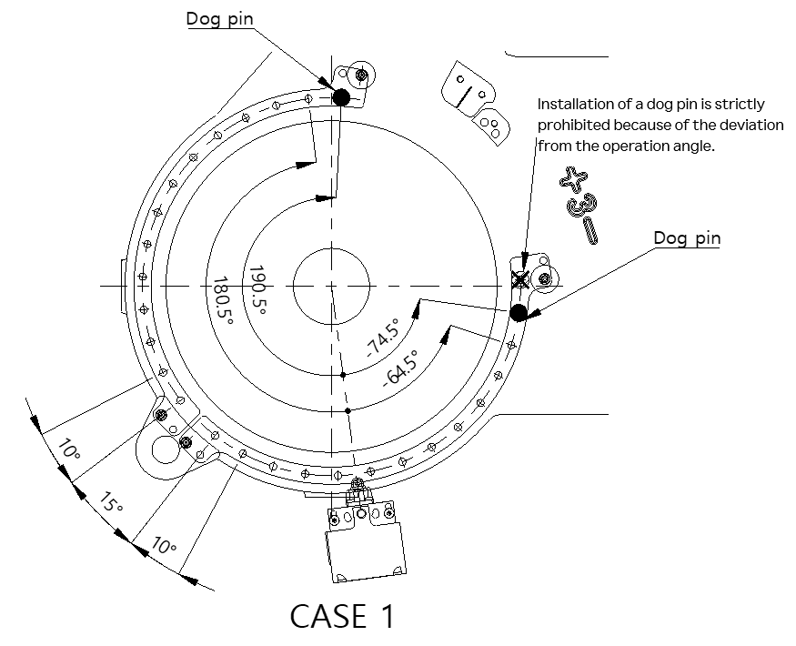
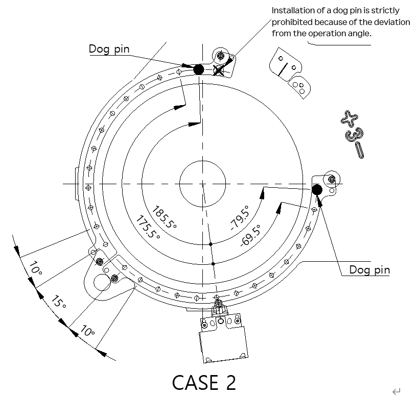
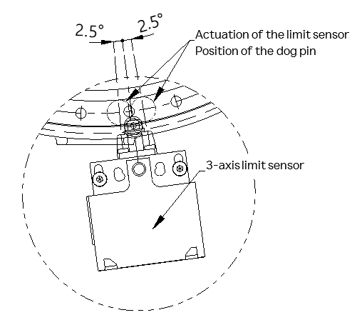

# 2.9.2.3. Application of the 3-Axis Limit Switch (Optional)

The 3-axis limit switch is optional, and when applying a limit switch, attach the dog pin to the limit switch plate by fastening the bolt according to the criteria shown below, by referring to Figure 2.20.

-	Limit sensor plate fixing bolt: M5X10L HEX SOCKET BOLT, 4EA
-	Dog pin fixing bolt: M5X10L HEX SOCKET BOLT, 2EA
-	Tightening torque: 83 kgf.cm (8.14 N.m)

Figure 2.20 Method for Installation of the 3-Axis Limit Switch Plate and Dog Pins

Axis-3’s work envelope can be basically set by adjusting the position of the two dog pins. Dog pins can be installed at the intervals of 10˚, and when the position of the fixing hole of the plate is changed, the work envelope can be limited at the intervals of 5˚. For the work envelope for each case, refer to Table 2 7, Table 2 8, Figure 2.21, and Figure 2.23.

Figure 2.21 2-Axis Limit Switch Plate Fixing Position

Table 2-7 Cases of the 3-Axis Limit Switch Plate Installation

<table class="tg">
<thead>
  <tr>
    <th class="tg-3h1q">CASE</th>
    <th class="tg-3h1q">1(basic)</th>
    <th class="tg-3h1q">2</th>
  </tr>
</thead>
<tbody>
  <tr>
    <td class="tg-3h1q">POSITION SET</td>
    <td class="tg-3h1q">SET(1)</td>
    <td class="tg-3h1q">SET(2)</td>
  </tr>
 <tr>
    <td class="tg-3h1q">Max. work envelope</td>
    <td class="tg-9wq8">-74.5˚~190.5˚</td>
    <td class="tg-9wq8">-79.5˚~185.5˚</td>
  </tr>
</tbody>
</table>

    
 

Table 2-8 Work Envelope for Each Case of the 3-Axis Limit Switch Plate Installation

<table class="tg">
<thead>
  <tr>
    <th class="tg-gm1x" colspan="10">CASE 1(기본)</th>
  </tr>
</thead>
<tbody>
  <tr>
    <td class="tg-gm1x">Operation range</td>
    <td class="tg-nrix">190.5˚</td>
    <td class="tg-nrix">180.5˚</td>
    <td class="tg-nrix">…</td>
    <td class="tg-nrix">60.5˚</td>
    <td class="tg-nrix">44.5˚</td>
    <td class="tg-nrix">35.5˚</td>
    <td class="tg-nrix">…</td>
    <td class="tg-nrix">-64.5˚</td>
    <td class="tg-nrix">-74.5˚</td>
    </tr>
  <tr>
    <td class="tg-gm1x" colspan="10">CASE 2</td>
  </tr>
  <tr>
    <td class="tg-gm1x">Operation range</td>
    <td class="tg-nrix">185.5˚</td>
    <td class="tg-nrix">175.5˚</td>
    <td class="tg-nrix">…</td>
    <td class="tg-nrix">65.5˚</td>
    <td class="tg-nrix">40.5˚</td>
    <td class="tg-nrix">30.5˚</td>
    <td class="tg-nrix">…</td>
    <td class="tg-nrix">-69.5˚</td>
    <td class="tg-nrix">-79.5˚</td>
    </tr>
</tbody>
</table>

 

Figure 2.22 Examples of the 3-Axis Work Envelope

<table class="tg">
<thead>
  <tr>
    <td class="tg-b001"> Caution</td>
    <td class="tg-cly1">In the case of axis 3, never install a dog pin at the position marked X as shown in Figure 2.22. 
(actuation of the limit switch will be invalidated)
</td>
  </tr>
</thead>
</table>

 

Depending on the starting position where the limit switch is pressed by the dog, there may be an error of approximately 2.5˚ in the work envelope.

Figure 2.23 3-Axis Limit Sensor Contact Range