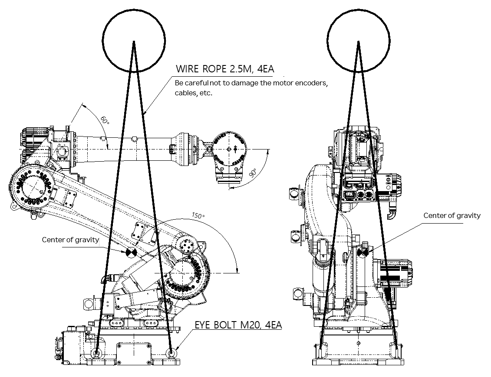
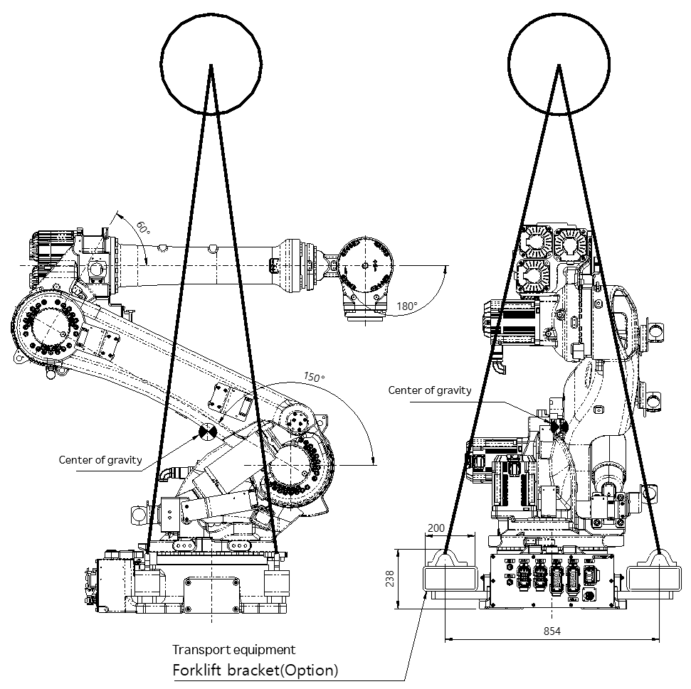

# 3.2.1. Using a Crane

The manipulator can be transported using a crane. You can attach an eye bolt or lifting bracket to the robot’s base body and fasten a wire rope to it.

For safety, please observe the following procedures.

*	Never walk under the manipulator.
*	Pose the robot as shown in Figure 3.3.
*	Install four M20 eyebolts or a lifting bracket to the base body.
*	Connect the wire rope (four units) to the eye bolt (four units) or lifting bracket.
*	Minimum crane capacity: 2.5 t. Minimum rope capacity: 1 t/piece
*	Attach a protective hose (50 cm) to prevent the manipulator from being damaged.
*	Follow the safety regulations when lifting the robot.
*	Fix the ropes while being careful not to damage the motors, connectors, and cables of the robot.
*	Manipulator weight: 938 kg

Figure 3.3 How to Transport: Using a Crane (When Using Eyebolts)

<table class="tg">
<thead>
  <tr>
    <td class="tg-b001"> Caution</td>
    <td class="tg-cly1">When using eye bolts, be careful not to get the motors, internal wirings, and cables crushed.</td>
  </tr>
</thead>
</table>

Figure 3.4 How to Transport: Using a Crane (When Using a Lifting Bracket)

<table class="tg">
<thead>
  <tr>
    <td class="tg-b001"> Caution</td>
    <td class="tg-cly1">The following instructions for lifting the robot are valid for a factory-shipped robot. When an end effector is installed, the above transportation posture cannot be used because of the change of the location of the center of gravity.</td>
  </tr>
</thead>
</table>
