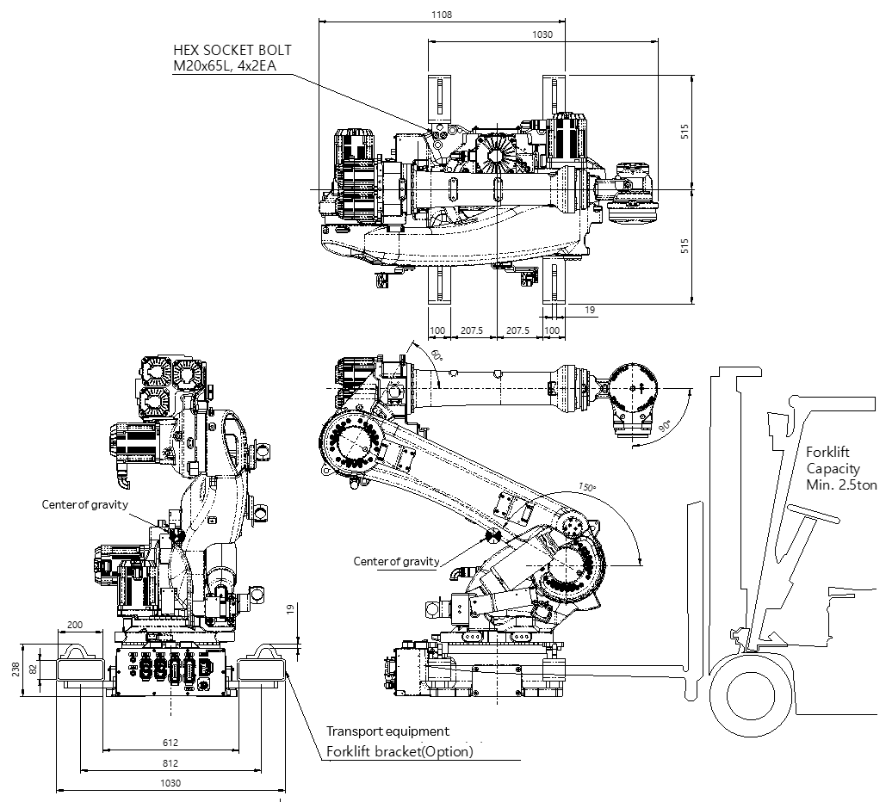
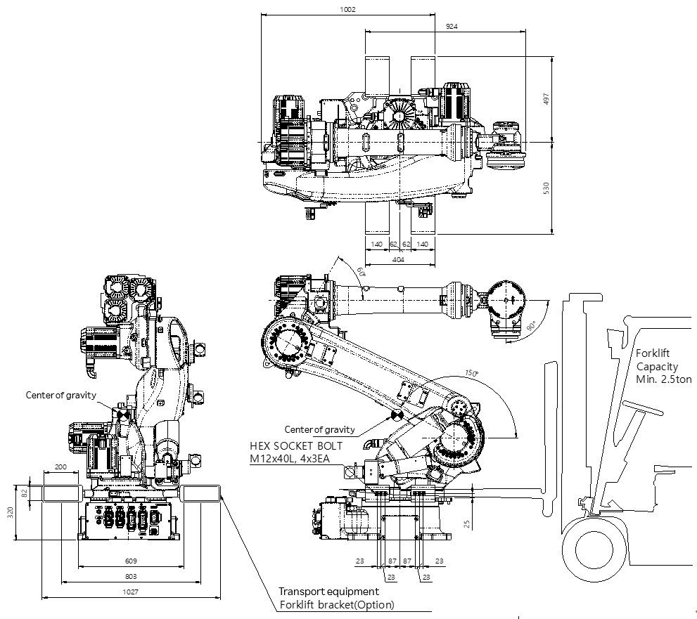

# 3.2.2. Using a Forklift

A forklift can be used to transport the manipulator.

For safety, please observe the following procedures.

*	Set the robot into the basic posture by referring to the figure.
*	Check whether the fixing bolts of the transport equipment (forklift bracket) are loose, and tighten them to make sure they are not loose.
*	Be careful to prevent collision between the forklift’s fork and the transport equipment.
*	Before transporting the robot using a forklift, make sure that it keeps its horizontal level.
*	Transport the robot at a slow speed. 
*	Follow safety regulations.

<table class="tg">
<thead>
  <tr>
    <td class="tg-b001"> Caution</td>
    <td class="tg-cly1">-	Do not lean against the robot while transporting it. 
-	Make sure the robot does not collide with the floor while you are loading and unloading it. 
-	Observe the relevant safety rules while working with the forklift. 
-	When transporting a forklift using a skid, check whether the bolts between the robot and the skid are loose, and tighten them to make sure they are not loose. 
-	To prevent a collision between the transport equipment and the robot, make sure to disassemble the transport equipment before operating the robot.
</td>
  </tr>
</thead>
</table>

Figure 3.5 How to Transport: Use a Forklift (Base Body Type)

Figure 3.6 How to Transport: Use a Forklift (Lower Frame Type)

