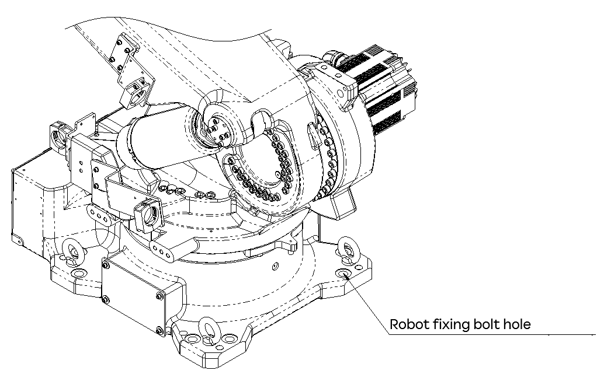

# 3.2. How to Transport

The robot can be transported using a crane or forklift. When moving the robot, make sure to pose the robot as shown in the table below and then transport it using eye bolts and designated transport equipment. The robot’s posture for transportation is as follows.

<table class="tg">
<thead>
  <tr>
    <th class="tg-baqh">1(S)- Axis</th>
    <th class="tg-baqh">0</th>
  </tr>
</thead>
<tbody>
  <tr>
    <td class="tg-baqh">2(H)- Axis</td>
    <td class="tg-baqh">150</td>
  </tr>
  <tr>
    <td class="tg-baqh">3(V)- Axis</td>
    <td class="tg-baqh">-60</td>
  </tr>
  <tr>
    <td class="tg-baqh">4(R2)- Axis</td>
    <td class="tg-baqh">0</td>
  </tr>
  <tr>
    <td class="tg-baqh">5(B)- Axis</td>
    <td class="tg-baqh">-90</td>
  </tr>
  <tr>
    <td class="tg-baqh">6(R1)- Axis</td>
    <td class="tg-baqh">0</td>
  </tr>
</tbody>
</table>

<table class="tg">
<thead>
  <tr>
    <td class="tg-b001"> Caution</td>
    <td class="tg-cly1">-	When moving or lowering the robot, move it slowly and be very careful. 
-	When unloading the robot onto the floor, be careful not to cause a strong collision between the bottom installation surface of the robot and the floor’s surface. 
-	Never transport the robot with anything other than the specified transport equipment and methods. 
-	When transporting the robot, be very careful not to allow its motors, connectors, cables, etc., to be damaged by the crane wire or forklift. 
-	When transporting the robot, keep its horizontal level. 
-	When transporting the robot using a forklift, check the transport equipment fixing bolts, and tighten any loose bolts. 
-	When you disassemble or assemble the transport equipment (forklift brackets), the manipulator may rotate. Fix the robot with bolts using the robot fixing bolt holes to prevent the robot from falling over.
</td>
  </tr>
</thead>
</table>

Figure 3.2 Robot Fixing Bolt Hole