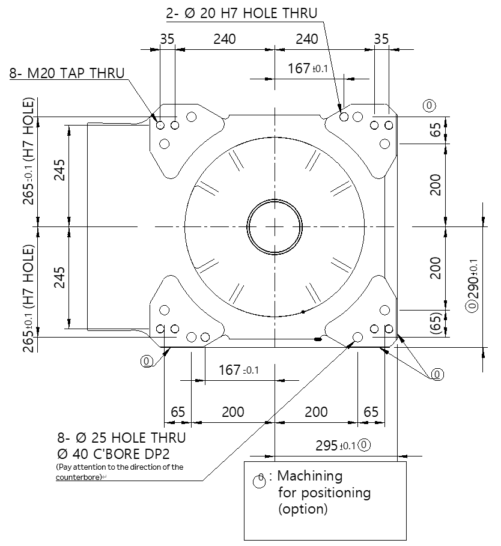

# 3.4.4. Dimensions of the Installation Surface

When attaching the manipulator, fix the bottom surface of the swivel base (base body).

Please refer to the pictures below for the dimensions.

Figure 3.10 Dimensions of the Robot Installation Surface