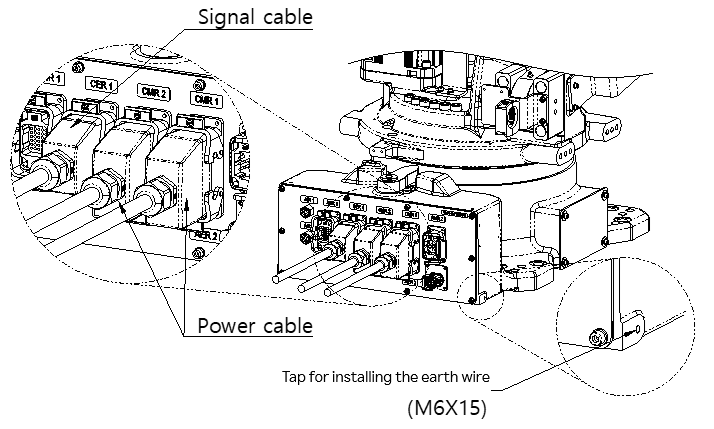

# 3.4.5. Connecting the Robot Cables

Figure 3.11 Connecting the Robot Cables

The robot is connected to the controller through the power and signal cables. Connect these cables to the connectors on the back of the robot base body. Also connect the grounding wire.
For connection of the pneumatic and optional cables, refer to “2.8. Wiring and Piping Diagrams for Applications.”

<table class="tg">
<thead>
  <tr>
    <td class="tg-b001"> Caution</td>
    <td class="tg-cly1">Make sure to turn off the power of the controller when connecting the cables.</td>
  </tr>
</thead>
</table>

