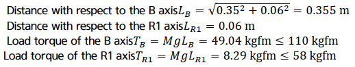
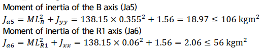
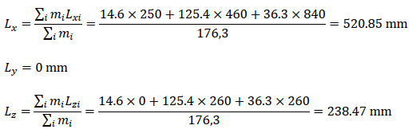
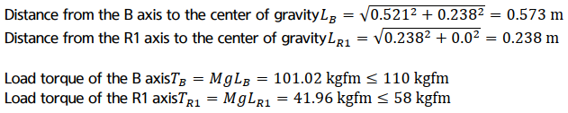
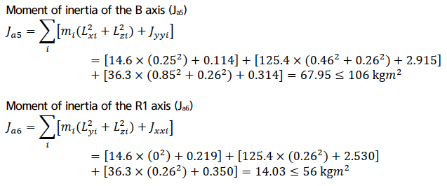

# 3.5.3. Example of permitted torque and inertia moment calculation (HS180 Case)

(1)	Case #1 Simple 2-D model

Figure 3.14 2D Load Model

M - Load weight

Jxx - Inertia moment in X direction from weight center of load

Jyy - Inertia moment in Y direction from weight center of load

Jzz - Inertia moment in Z direction from weight center of load

Ja4 - Inertia moment from R2 axis rotation center

Ja5 - Inertia moment from B axis rotation center

Ja6 - Inertia moment from R1 axis rotation center

 
  
☞ Load condition: Stainless steel with length and width of 260mm and thickness of 260mm (Mass 138.15kg)

① Weight limitation

Load weight: 138.15 ≤180 kg

    

②	Permitted torque limit

Location of B axis weight center   LX = 350mm, LY = 0mm, LZ = -60mm

The distance from the axis B and R1 to the center of gravity can be calculated as follows.

 

③	Permitted inertia moment limit

Inertia moment of load from the weight   Jxx= 1.56kgm², Jyy= 1.56 kgm², Jzz= 1.56 kgm²

 
  
④	Conclusion

It is safe because the weight, torque and inertia moment all satisfy the limited condition.

  

(2)	Case #2 Complicated 3-D model

Figure 3.15 2D Shape of the 3D Load Model

  

Aluminum block shape combination
(σ=0.0027 g/mm3 : 176.3 kg)

m1 (60×300×300)	 14.6kg

m2 (480×440×220)	125.4kg

m3 (280×300×160)	 36.3kg

 

mi  - i 블록 부하 중량

Lxi - Weight center location in X axis direction of I block

Lyi - Weight center location in Y axis direction of I block

Lzi - Weight center location in Z axis direction of I block

 

①	Weight limitation

Load weight : 176.3 ≤180 kg

 

②	Permitted torque limit

You can calculate the weight center location for the total load from the B axis rotation center as follows.

 

The weight center location for the total load from the B axis rotation center Lx = 520.85mm, Ly = 0mm, Lz= -238.47mm

 

 

x1 y1 z1 – x, y and z direction length of block m1

x2 y2 z2 – x, y and z direction length of block m2

x3 y3 z3 – x, y and z direction length of block m3

 

LX1, LY1, LZ1 - Weight center location of block m1 from B axis rotation center

LX2, LY2, LZ2 - Weight center location of block m2 from B axis rotation center

LX3, LY3, LZ3 - Weight center location of block m3 from B axis rotation center

 

Jxx1, Jyy1, Jzz1 – Inertia moment by x, y and z axis from the weight center of block m1

Jxx2, Jyy2, Jzz2 – Inertia moment by x, y and z axis from the weight center of block m2

Jxx3, Jyy3, Jzz3 – Inertia moment by x, y and z axis from the weight center of block m3

Figure 3.16 3D Shape of the 3D Load Model

 

③	Permitted inertia moment limit

Table 3-5 Inertia moment from weight center by block

<table class="tg">
<thead>
  <tr>
    <th class="tg-1e26">Block weight (kg)</th>
    <th class="tg-1e26">Weight center(LX, LY, LZ)</th>
    <th class="tg-1e26">Jxx</th>
    <th class="tg-1e26">Jyy</th>
    <th class="tg-1e26">Jzz</th>
  </tr>
</thead>
<tbody>
  <tr>
    <td class="tg-amwm">m1(14.6)</td>
    <td class="tg-baqh">(0.25, 0, 0)</td>
    <td class="tg-baqh">0.219 kgm²</td>
    <td class="tg-baqh">0.114 kgm²</td>
    <td class="tg-baqh">0.114 kgm²</td>
  </tr>
  <tr>
    <td class="tg-amwm">m2(125.4)</td>
    <td class="tg-baqh">(0.48, 0, -0.26)</td>
    <td class="tg-baqh">2.530 kgm²</td>
    <td class="tg-baqh">2.915 kgm²</td>
    <td class="tg-baqh">4.433 kgm²</td>
  </tr>
  <tr>
    <td class="tg-amwm">m3(36.3)</td>
    <td class="tg-baqh">(0.89, 0, -0.26)</td>
    <td class="tg-baqh">0.350 kgm²</td>
    <td class="tg-baqh">0.314 kgm²</td>
    <td class="tg-baqh">0.509 kgm²</td>
  </tr>
</tbody>
</table>

 

 

④	Conclusion

It is safe because the weight, torque and inertia moment all satisfy the limited condition.
