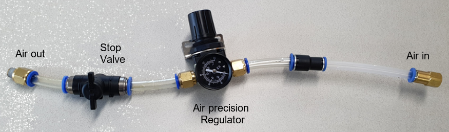

# 5.1.8. Sequence for Discharging the Grease

(1)	Check the difference between the amount of the injected grease and the amount of the discharged grease, and then determine the amount of grease to be discharged.

(2)	Pose the robot to ensure that it has no interference from surrounding facilities when it is operating.

(3)	Attach a grease receiver such as vinyl with an opened entrance to the grease inlet to prevent the contamination of the surrounding area.

(4)	Prepare a grease receiver of a size that takes into consideration the amount of grease to be discharged.

(5)	Install an air precision regulator set adjusted to 0.025 Mpa to the grease outlet.
The air precision regulator set consists of an air hose, a stop valve, and male push-to-connect fittings. Before installing the set, you need to open and close the stop valve to ensure that the instructed pressure is not exceeded. After that, set the stop valve handle to the Stop state so that air is not supplied.

(6)	When discharging grease, pay attention so that the pressure at the grease injection part does not exceed 0.025 Mpa.

(7)	Check if the plug of the inlet through which the grease will be discharged is removed.

(8)	Open the stop valve to allow the grease to be discharged by air pressure, and check the amount of the discharged grease.

(9)	If the amount of the discharged grease is insufficient, rotate the robot slowly so that the grease can be easily discharged.

(10) When the discharging of the grease is completed, remove the grease receiver and regulator set.

(11) Remove the contaminated grease around the inlet and outlet with a clean cloth.

(12) Connect the plugs to the outlet and inlet.

<table class="tg">
<thead>
  <tr>
    <td class="tg-e3v1"> Warning</td>
    <td class="tg-cly1">If air is supplied at too high a pressure to the inside of the grease barrel, etc., of the reducer where grease is injected, there is a risk of sudden grease ejection. It must be covered so that the grease being charged from the grease outlet can only be discharged to the grease receiver. When discharging grease, you should wear protective clothing such as protective glasses, a face shield, etc.

To ensure that the pressure inside the grease barrel does not exceed 0.025 Mpa, set the pressure of the regulator by increasing its pressure from 0 Mpa to 0.025 Mpa gradually before installing it to the grease barrel. After that, check whether the set pressure is appropriate by opening and closing the stop valve several times, and then install the regulator set to the outlet of the grease barrel. After installing the set, open and close the stop valve to check once more if the pressure is appropriate.
</td>
  </tr>
</thead>
</table>

 

