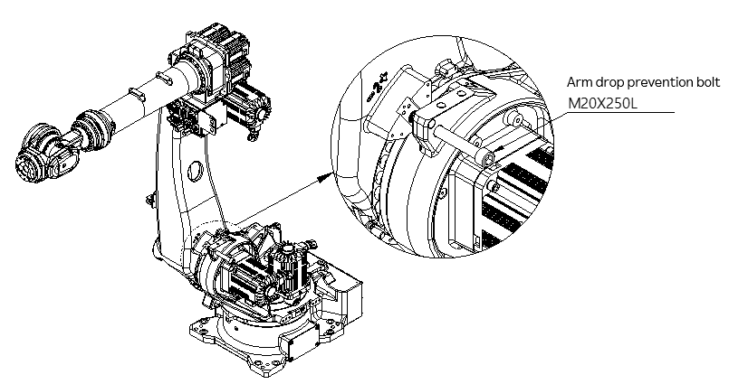
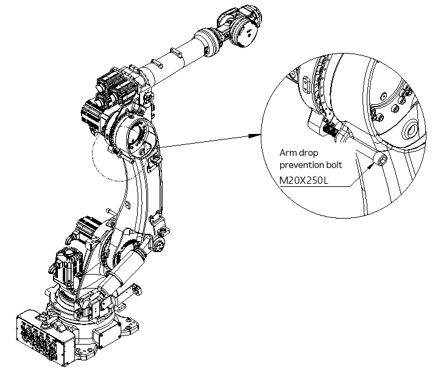

# 6.4.2. How to Replace the Motor

<table class="tg">
<thead>
  <tr>
    <td class="tg-b001"> Caution</td>
    <td class="tg-cly1">When the motor is separated, the arm will drop because of its built-in brakes for holding the robot’s posture. To prevent this, the user must make sure that safety measures, such as suspending the arm using devices like a crane, etc., and fixing the arm by inserting a fixing bolt, are implemented.</td>
  </tr>
</thead>
</table>

(1)	Set the controller to teaching mode, and turn the Operation Ready mode [ON]. 

(2)	Set the axis whose motor is to be replaced into the basic posture. If it is impossible to set the Operation Ready mode to the [ON] state or move the motor’s axis, perform the work starting from step (3).

(3)	When replacing the 2 and 3 axes, insert the arm drop prevention fixing bolts by referring to Figure 6.1–Figure 6.2. If inserting the fixing bolt is not possible, take measures to prevent dropping by using a crane, etc.

(4)	Turn the controller power [OFF], and turn the primary power [OFF].

(5)	Disconnect the motor wiring.

(6)	Remove the motor attachment bolt, and remove the motor from the manipulator.
When disassembling the motors of the 2 axis (H axis) and 3 axis (V axis), you should be careful not to allow the lip of the oil seal to be damaged by the gear attached to the motor’s axis.

(7)	Remove the gear attached to the motor shaft. 
At this time, be careful not to apply strong shock to the motor shaft.

(8)	Apply a thin layer of grease to the shaft of the new motor to be assembled, and then assemble the gear.
At this time, clean and degrease the bolts that will be used to fasten the gear to the motor shaft, and apply loosening prevention bond (Loctite 243) to the entire screw fastening surface. Fasten the bolts according to the specified torque using a torque wrench. Also, when fastening the motor to the manipulator, tighten the bolts slowly in a symmetrical direction.

(9)	Apply a small amount of grease to the lip of the oil seal, and then attach the motor to the manipulator. When attaching the motors of the main axes, you should make sure that the lip of the oil seal is not damaged by the gear attached to the axis of the motor.

(10)	Connect the motor wiring.

(11)	When replacing the motors of the 2 axis (H axis), and 3 axis (V axis), replenish the grease until it is equal in amount to the grease that has leaked.

(12)	Reset the encoder of the axis for which the motor has been replaced.

<table class="tg">
<thead>
  <tr>
    <td class="tg-b001"> Caution</td>
    <td class="tg-cly1">Before compensating the encoder, set the Operation Ready mode to the [ON] state, and press the Enable switch on the teach pendant for two to three seconds to check whether the power is supplied.</td>
  </tr>
</thead>
</table>

(13)	Compensate the encoder of the axis on which the motor was replaced by referring to “7.4.4. Encoder Offset in the Hi6 Controller Operation Manual.”

(14)	Disassemble the M20 bolts, which are the arm drop prevention bolts of the 2 axis (H axis) and 3 axis (V axis) or deactivate the drop prevention measures.

(15)	Check if there are any problems with the robot operation.

Figure 6.1 Arm (2 axis [H axis]) Fixing Bolt Insertion Location

Figure 6.2 Arm (3 axis [V axis ]) Fixing Bolt Insertion Location
