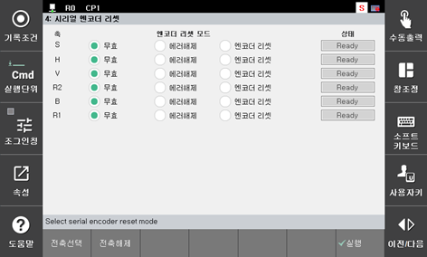

# 6.5.2. Encoder Reset

(1)	Turn off the motor.

(2)	Enter the serial encoder reset window. (“[F2]: System” → “5: Initialization” → “4: Serial Encoder Reset”)

 
Figure 6.4 Serial Encoder Reset

(3)	Move to the targeted axis using the [↓] and [↑] keys and then perform the setting using the [Encoder Reset] function by operating the [SHIFT] + [←][→] keys, and then press the Execute key.

(4)	Reset the encoder. The user must change the controller power from the Off state to the On state.
 
