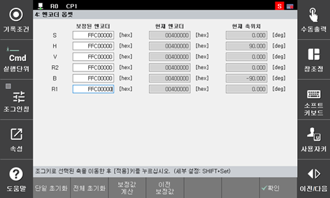

# 6.5.3. Encoder Compensation and Selection

*	It is necessary to compensate the encoder data at the reference position of each axis of the robot.

*	Compensate the encoder by referring to “Encoder Compensation” in the controller operation manual.

[Encoder Compensation Screen]

Figure 6.5 Encoder Compensation

(1)	Select an axis, move the axis to the reference position using the [Axis Operation] key, and press the “[F1]: Single Initialization” key.

(2)	When you move all axes to their reference positions using the [Axis Operation] key and press the “[F2]: All initialization” key, the encoder offset compensation will be conducted for all axes at once.

(3)	To save the settings data, press the “[F7]: OK” key. When you press the [ESC] key, the changed data will not be saved.

<table class="tg">
<thead>
  <tr>
    <td class="tg-b001"> Caution</td>
    <td class="tg-cly1">When performing the encoder data compensation after replacing a motor, first turn Power Ready mode “ON,” and check whether power is supplied to the motor.</td>
  </tr>
</thead>
</table>

