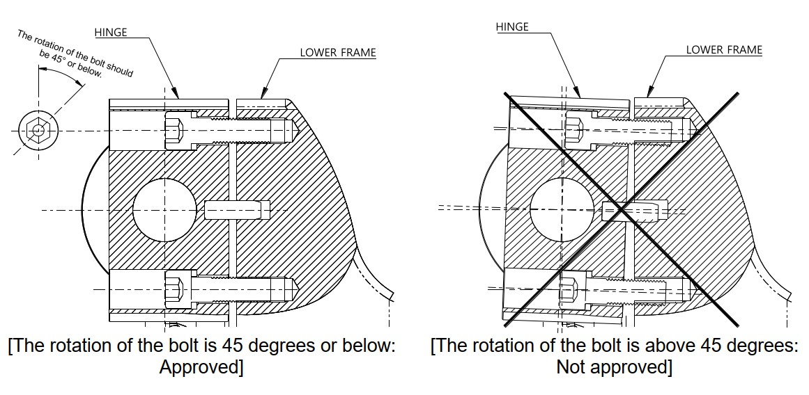

# 8.2.1. Separation of the Gas Spring

When separating the gas spring, you must keep the robot in the posture shown in Figure 8.1. In this posture, the compression force of the gas spring will be minimized so that it can be separated from the robot. 
However, when required to separate the gas spring to dispose of it or repair its internal parts, first remove the gas completely according to the procedure for discharging gas from the gas spring.

Figure 8.1 Postures for Assembling, Dismantling, and Maintaining the Gas Spring

<table class="tg">
<thead>
  <tr>
    <th class="tg-baqh">1- Axis</th>
    <th class="tg-baqh">0</th>
  </tr>
</thead>
<tbody>
  <tr>
    <td class="tg-baqh">2- Axis</td>
    <td class="tg-baqh">90</td>
  </tr>
  <tr>
    <td class="tg-baqh">3- Axis</td>
    <td class="tg-baqh">0</td>
  </tr>
  <tr>
    <td class="tg-baqh">4- Axis/td>
    <td class="tg-baqh">0</td>
  </tr>
  <tr>
    <td class="tg-baqh">5- Axis</td>
    <td class="tg-baqh">0</td>
  </tr>
  <tr>
    <td class="tg-baqh">6- Axis</td>
    <td class="tg-baqh">0</td>
  </tr>
</tbody>
</table>

<table class="tg">
<thead>
  <tr>
    <td class="tg-b001"> Caution</td>
    <td class="tg-cly1">-	When assembling and disassembling the gas spring, fasten or dismantle the bolts by rotating the upper and lower bolts alternately at less than 45 degrees as shown in Figure 8.2 to prevent the hinge from being excessively tilted. 
-	Excessive tilting of the hinge will damage the bolts, and damaged bolts will damage even the tap of the frame, making it difficult to perform the disassembly and assembly work. 
-	The shape of each part, such as the hinge, may change without a notice.
</td>
  </tr>
</thead>
</table>

Figure 8.2 Precautions for Dismantling the Gas Spring Hinge Fixing Bolts