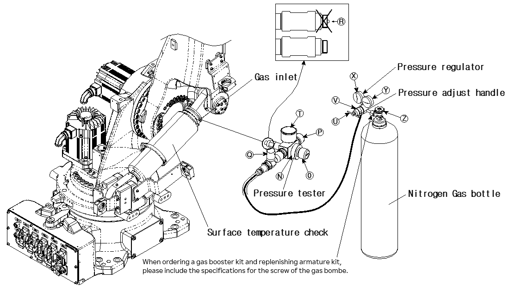

# 9.2.1. When the Pressure of the Nitrogen Gas Bombe Exceeds 120 bar

(1)	Set the robot’s 2 axis to a 90° posture, and cut off the power of the controller.

(2)	Remove the plug installed to the gas inlet of the gas spring.

(3)	Check that the bleed valve ○P and shut-off valve ○Q of the pressure tester are closed
(locked clockwise.)

(4)	Turn the knob ○O counterclockwise to prevent the release pin ○R from protruding.

(5)	Turn the knob ○N of the pressure tester clockwise to completely connect it to the gas inlet.

(6)	Check whether the handle ○U and shut-off valve○Q are closed.

(7)	Connect the screw of the connection part of the regulator to the screw of the nitrogen gas bombe. 
(Hoses should be connected as shown in the figure.)
Each country has different specifications for the screw of the nitrogen bombe. Purchase a regulator that meets the specifications for the screw of the nitrogen bombe.
If the pressure of the nitrogen gas bombe is 150 bar or below, a booster should be fitted as well as a regulator. (Condition for a nitrogen gas bombe that can perform the charging without a booster: It can keep the pressure at 150 bar or more and be capable of charging the gas spring with the pressure of 120 bar.)

(8)	The gauge ○Xindicates the set gas pressure, and the gauge ○Y indicates the pressure of the nitrogen gas bombe.

(9)	Open the knob ○Z of the nitrogen gas bombe, and then turn the handle ○U of the regulator (○V) to set the specified gas pressure. (The specified gas pressures are shown in Table 9.1 Pressure for Each Temperature.)

(10)	Open the shut-off valve ○Q slowly and perform the charging until the pressure gauge ○T reaches the set pressure.

(11)	When the set pressure is reached, close the shut-off value ○Q and then open the bleed valve ○P to release the residual pressure remaining inside the 
pressure tester.
Do not unscrew the bleed valve ○P more than 360°.

(12)	Close the bleed valve ○P to adjust the gas pressure in the gas spring.

(13)	While slowly turning the knob ○O clockwise, check the pressure on the pressure gauge ○T.
Take precautions not to allow the release pin ○R to go inside excessively and damage the valve mounted on the gas spring.

(14)	When the set pressure is exceeded, adjust the gas pressure to the desired pressure by opening and closing the bleed valve ○P little by little.

(15)	Turn the knob ○O counterclockwise to retreat the release pin ○R.

(16)	When the pressure is checked, the bleed valve ○P should be opened to completely release the residual pressure remaining inside the pressure tester.

(17)	Close the knob ○Z of the nitrogen gas bombe and loosen the regulator connection part to separate it from the nitrogen gas bombe.

(18)	Loosen the shut-off connection part to separate it from the pressure tester.

(19)	Turn the knob ○N of the pressure tester counterclockwise to disconnect it from the gas spring.

(20)	Check the check valve of the gas spring for oil leakage or gas leakage.
Warning! Do not look directly into the check valve hole if the gas bombe is filled with gas.

(21)	Connect the G1/8 plug to the gas spring.
After charging the gas, allow about 30 min for the gas temperature to return to room temperature before use.

Figure 9.2 Replenishing of the Gas of the Gas Spring

<table class="tg">
<thead>
  <tr>
    <td class="tg-b001"> Caution</td>
    <td class="tg-cly1">The gas replenishing kit may vary in shape and name depending on the type, so please refer to the manual enclosed upon purchase.
</td>
  </tr>
</thead>
</table>
