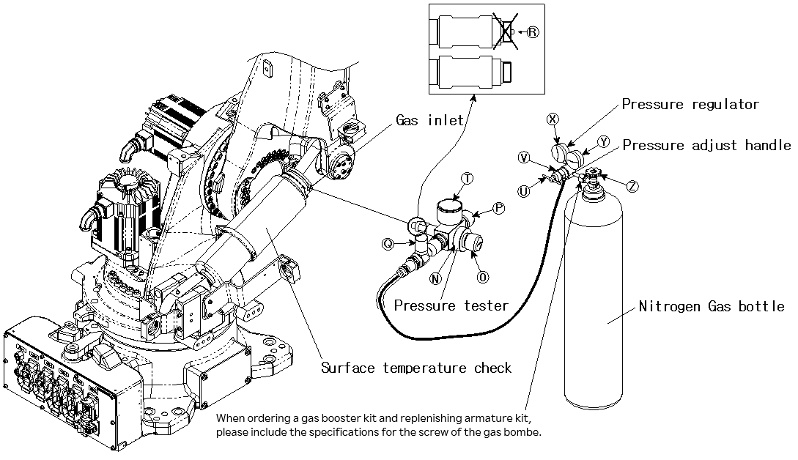

# 9.2.2. When the Pressure of the Nitrogen Gas Bombe is 150 Bar or Below (Replenishing the Gas Using the Booster)

(1)	Set the robot’s 2 axis to a 90° posture, and cut off the power of the controller.

(2)	Remove the plug installed to the gas inlet of the gas spring.

(3)	Check that the bleed valve ○P and shut-off valve ○Q of the pressure tester are closed
(locked clockwise.)

(4)	Turn the knob ○O counterclockwise to prevent the release pin ○R from protruding.

(5)	Turn the knob ○N of the pressure tester clockwise to completely connect it to the gas inlet.

(6)	Check whether the handle ○U, shut-off valve ⓦ, knob ⓢ (the knob of the air hose owned by the customer), and shut-off valve ○Q are locked.

(7)	Connect the screw of the connection part of the regulator to the screw of the nitrogen gas bombe. 
(The connection parts of hoses should be connected to each connection inlet.) 
Each country has different specifications for the screw of the nitrogen bombe. Purchase a regulator that meets the specifications for the screw of the nitrogen bombe.

(8)	The gauge ○X indicates the set gas pressure of the nitrogen gas bombe, and the gauge ○Y indicates the pressure of the nitrogen gas bombe.

(9)	Open the knob ○Z of the nitrogen gas bombe, and then turn the handle ○U of the regulator ○V to set the set gas pressure. (The specified gas pressures are shown in Table 9.1 Pressure for Each Temperature.)

(10)	 Open the shut-off valve ⓦ of the hose connected to the regulator ○V, and slowly turn the shut-off valve ○Q to be connected to the pressure tester counterclockwise until the pointer of the pressure gauge ○T matches the pointer of the gauge ○X.

(11) Connect the connection part of the air hose to the booster, and then open the knob ⓢ (the knob of the air hose owned by the customer) to operate the booster.           
Charge until the pointer of the pressure gauge ○T reaches the set pressure. 
※	During charging, the minimum air pressure should be 5 bar or more. 
Replace the nitrogen gas bombe when the residual pressure is 30 bar or less.

(12) When the set pressure is reached, close the shut-off value ○Q and then open the bleed valve ○P to release the residual pressure remaining inside the 
pressure tester. 
(Do not unscrew the bleed valve ○P more than 360°.)

(13) Close the bleed valve ○P and turn the knob ○O clockwise little by little while checking that the pointer of the pressure gauge ○T matches the set pressure. Once they match, stop the work.
Take precautions not to allow the release pin ○R to go inside excessively and damage the check valve mounted on the gas spring.

(14) When the set pressure is exceeded, you should adjust the gas pressure to the desired pressure by opening and closing the bleed valve ○P little by little.

(15) Turn the knob ○O counterclockwise to retreat the release pin ○R.

(16) When the pressure is checked, the bleed valve ○P should be opened to completely release the residual pressure remaining inside the pressure tester.

(17) Close the knob ⓢ of the air hose and separate it from the booster.

(18) Close the shut-off valve ⓦ of the hose connected to the regulator and close the handle ○U. 

(19) Close the knob ○Z of the nitrogen gas bombe and separate the hose connected to the regulator ○V from the booster. After that, open the shut-off value ⓦ to completely release the residual pressure remaining inside.

(20) Separate the shut-off valve connection part from the pressure tester.

(21) Turn the knob ○N of the pressure tester counterclockwise to disconnect it from the gas spring. 
Connect the G1/8 plug to the gas spring. 
After charging the gas, allow about 30 min for the gas temperature to return to room temperature before use.

Figure 9.3 Replenishing the Gas of the Gas Spring Using the Booster

<table class="tg">
<thead>
  <tr>
    <td class="tg-b001"> Caution</td>
    <td class="tg-cly1">The gas replenishing kit may vary in shape and name depending on the type, so please refer to the manual enclosed upon purchase.
</td>
  </tr>
</thead>
</table>
