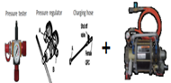
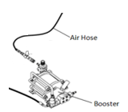

# 9.4.4. Parts for Gas Spring Pressure Measuring and Gas Charging

Table 9-3 Parts for Gas Spring Pressure Measuring and Gas Charging

<table class="tg">
<thead>
  <tr>
    <th class="tg-amwm">Part NAME AND SPECIFICATION</th>
    <th class="tg-amwm">PART NO</th>
    <th class="tg-amwm">QUANTITY PER UNIT</th>
    <th class="tg-amwm">SHAPE</th>
    <th class="tg-amwm">SUPPLIED BY</th>
  </tr>
</thead>
<tbody>
  <tr>
    <td class="tg-baqh">GAS SPRING ASSY</td>
    <td class="tg-baqh">P7000000710 P7000000730</td>
    <td class="tg-baqh">1</td>
    <td class="tg-baqh"></td>
    <td class="tg-baqh">Hyundai Robotics (OPTION)</td>
  </tr>
  <tr>
    <td class="tg-baqh">PRESSURE TESTER-1 (FOR MEASURING THE PRESSURE)</td>
    <td class="tg-baqh">R7900162380</td>
    <td class="tg-baqh">1</td>
    <td class="tg-baqh"></td>
    <td class="tg-baqh">Hyundai Robotics (OPTION)</td>
  </tr>
  <tr>
    <td class="tg-baqh">REPLENISHING ARMATURE KIT-1
+ GAS BOOSTER KIT-1
1. FOR CHARGING THE GAS WHEN THE NITROGEN GAS BOMBE’S PRESSURE IS 150 BAR OR BELOW 
2. ITEM TO BE INCLUDED WHEN THE CUSTOMER ORDERS: GAS BOMBE CONNECTION PART SCREW SPECIFICATION
</td>
    <td class="tg-baqh">R7900164390 R7900162750</td>
    <td class="tg-baqh">1</td>
    <td class="tg-baqh"></td>
    <td class="tg-baqh">Hyundai Robotics (OPTION)</td>
  </tr>
  <tr>
    <td class="tg-baqh">REPLENISHING ARMATURE KIT-1 
1. . FOR CHARGING THE GAS WHEN THE NITROGEN GAS BOMBE’S PRESSURE 
EXCEEDS 150 BAR
 
2. ITEM TO BE INCLUDED WHEN THE CUSTOMER ORDERS: GAS BOMBE CONNECTION PART SCREW SPECIFICATION
</td>
    <td class="tg-baqh">R7900164390</td>
    <td class="tg-baqh">1</td>
    <td class="tg-baqh"></td>
    <td class="tg-baqh">Hyundai Robotics (OPTION)</td>
  </tr>
  <tr>
    <td class="tg-baqh">GAS BOOSTER KIT-1 
1. FOR INCREASING THE PRESSURE WHEN THE NITROGEN GAS BOMBE’S PRESSURE IS 150 BAR OR BELOW 
2. AIR INLET PLUG MALE : R1/4 
3. ITEM TO BE INCLUDED WHEN THE CUSTOMER ORDERS: GAS BOMBE CONNECTION PART SCREW SPECIFICATION
</td>
    <td class="tg-baqh">R7900162750</td>
    <td class="tg-baqh">1</td>
    <td class="tg-baqh"></td>
    <td class="tg-baqh">Hyundai Robotics (OPTION)</td>
  </tr>
  <tr>
    <td class="tg-baqh">AIR HOSE AND QUICK COUPLING (FOR SUPPLYING AIR)</td>
    <td class="tg-baqh">-</td>
    <td class="tg-baqh">1</td>
    <td class="tg-baqh"></td>
    <td class="tg-baqh">CUSTOMER</td>
  </tr>
</tbody>
</table>
