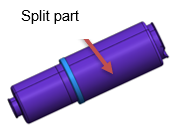
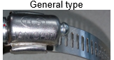

# 9.4.5. Gas Spring Protection Cover

<table class="tg">
<thead>
  <tr>
    <th class="tg-wa1i">Classification</th>
    <th class="tg-wa1i">Plastic cover</th>
    <th class="tg-wa1i">Remarks</th>
  </tr>
</thead>
<tbody>
  <tr>
    <td class="tg-wa1i">Appearance</td>
    <td class="tg-nrix"></td>
    <td class="tg-nrix"></td>
  </tr>
  <tr>
    <td class="tg-wa1i">Material</td>
    <td class="tg-nrix">PLASTIC(split type)</td>
    <td class="tg-nrix"></td>
  </tr>
  <tr>
    <td class="tg-wa1i">Required to disassemble the gas spring
  when replacing the protection cover</td>
    <td class="tg-nrix">X</td>
    <td class="tg-nrix"></td>
  </tr>
  <tr>
    <td class="tg-wa1i">Specification for the clamp</td>
    <td class="tg-nrix">○ Small size : 12W x Φ54 ○ Large size : 12W x Φ103 ○ Wrench size : 8mm ○ Tightening torque : 60kg/㎠</td>
    <td class="tg-nrix"></td>
  </tr>
  <tr>
    <td class="tg-wa1i">Images of clamps</td>
    <td class="tg-nrix"></td>
    <td class="tg-nrix"></td>
  </tr>
  <tr>
    <td class="tg-wa1i">Time for replacement</td>
    <td class="tg-nrix">When damaged because of an external impact occurs</td>
    <td class="tg-nrix"></td>
  </tr>
  <tr>
    <td class="tg-wa1i">Precautions for assembling</td>
    <td class="tg-nrix">Assemble such that there is no gap in the split part.</td>
    <td class="tg-nrix"></td>
  </tr>
</tbody>
</table>
